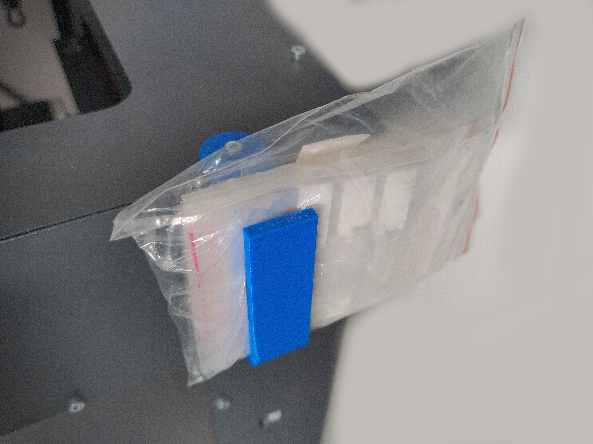

< [Back](../README.md)

# Miscellaneous holder

I use this to hold some little zip lock bags, but it can hold pretty much anything. 
You can easily (if you know a little bit about FreeCAD) customize the CAD file to make it the right size for whatever you want it to hold.
It's rounded so that it can be printed without support

