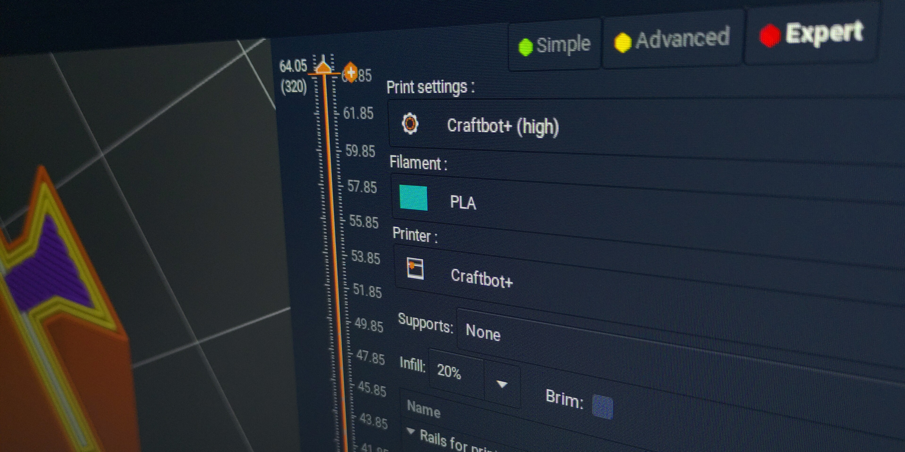

< [Back](../README.md)

# Presets for PrusaSlicer

The official slicer for the printer called craftware is kinda bad. A much better choice is PrusaSlicer, and I would definetly recommend you get familiar with it and start using it. Which is why I've made presets for the Craftbot Plus for PrusaSlicer.

## Installation instructions

The presets are in the folder `PrusaSlicer config files`.

Copy the files from there to your PrusaSlicer config folder located in:

Linux: `~/.config/PrusaSlicer`

MacOS: `~/Library/Application Support/PrusaSlicer`

Windows: `C:/users/<username>/Roaming/PrusaSlicer`

If a pop up appears saying that the folders already exist just choose either the 'write into' or 'overwrite' options.

Restart PrusaSlicer

