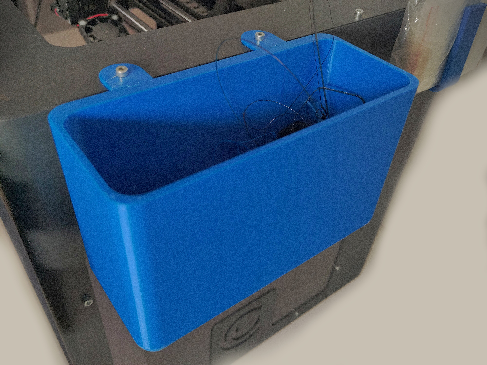

< [Back](../README.md)

# Detachable trash can

Probably the most useful of all the components, you can throw bits of filament and plastic in it to keep your printer area clean. When it's full you can just pop it off and empty it into a real trash can, it even has rounded corners so stuff doesn't get stuck in there.

